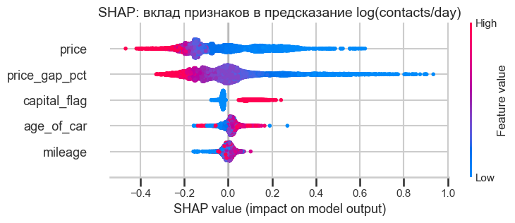
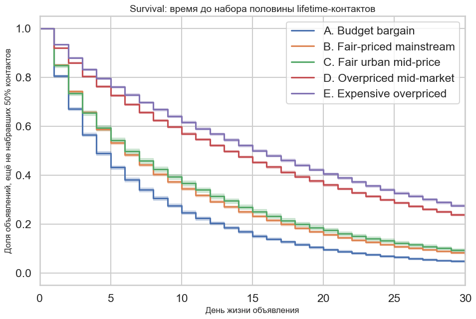
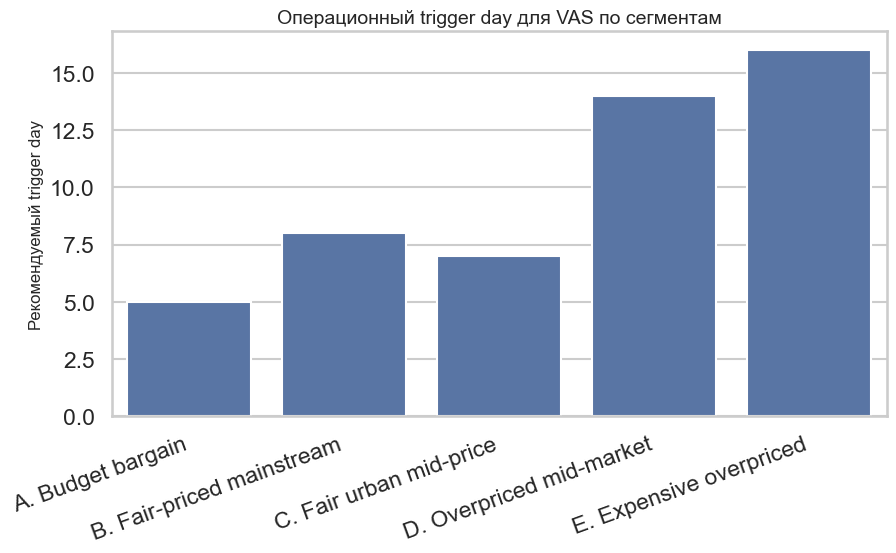

# Time-to-Sell: анализ ликвидности автообъявлений Avito


Исследование факторов ликвидности 160 000 автомобильных объявлений Avito и data-driven стратегия подключения платного продвижения (VAS).
Хакатон Avito x ИТМО, 2026. Команда поколенИИИе, 3 место.

## Коротко о результатах

- Главный драйвер ликвидности это отклонение цены от рыночной оценки (Price Gap), а не абсолютная цена. При контроле остальных факторов (NB GLM) переоцененные объявления теряют до 50% дневных контактов.
- Спрос фронт-лоадится: более половины органических контактов приходят в первые 7 дней жизни объявления.
- Рынок разбит на 5 операционных сегментов плюс отдельный сегмент битых авто. Между крайними сегментами 9-кратная разница в дневных контактах.
- Платное продвижение оптимально подключать на 5-8 день, в момент падения дневного притока вдвое. Для переоцененных авто сначала Price-nudge (совет снизить цену), затем VAS.
- Разработан Composite Liquidity Score (0-100) как признак для ML-ранжирования выдачи и дизайн двух связанных A/B-тестов.

## Задача

Бизнес-задача это понимание метрики Time-to-Sell автомобильных объявлений и рекомендации по оптимальному моменту подключения платных услуг. Быстрая продажа повышает удержание продавца, а свежий инвентарь повышает конверсию покупателя. Проблема текущих стратегий в неоптимальном расходе бюджета: продавец платит либо слишком рано (органика и так сильная), либо слишком поздно (объявление уже в мертвой зоне).

## Данные

Два набора данных: статичные признаки (марка, цена, IMV, регион, состояние, год, пробег, 18 признаков на 160 000 объявлений) и ежедневная динамика контактов по каждому объявлению. Находка очистки: оценка IMV отсутствует в 16.7% случаев, и пропуск не случаен, а соответствует статусу битого авто, поэтому такие объявления вынесены в отдельный сегмент.

Данные предоставлены организатором хакатона и в репозиторий не включены.

## Методы

- **EDA и предобработка:** анализ пропусков и выбросов, лог-шкалирование при овердисперсии, агрегация дневной динамики в кумулятивные профили.
- **Факторный анализ:** Spearman-корреляции, LightGBM + TreeSHAP для нелинейных эффектов, Negative Binomial GLM (statsmodels) для оценки вклада цены при контроле остальных факторов.
- **Сегментация:** правила на основе цены, Price Gap, региона и состояния; валидация деревом решений и тестом Kruskal-Wallis (p < 0.001).
- **Динамика спроса:** survival analysis (Kaplan-Meier, Cox hazard, log-rank), кластеризация кривых накопления (KMeans) в 4 поведенческих профиля.
- **Надежность:** bootstrap-доверительные интервалы, sensitivity analysis на удаление аномалий.
- **Внедрение:** дизайн двух A/B-тестов с рандомизацией по дню публикации и защитными метриками.

## Ключевые графики

Вклад признаков в дневную интенсивность контактов (LightGBM + SHAP):



Время до набора половины органических контактов (Kaplan-Meier):



Оптимальный день подключения VAS по сегментам:



## Стратегия продвижения

- Сегменты A и B (бюджетные и рыночные): VAS на 5-8 день, когда органика выдыхается.
- Профиль Instant spike: VAS на старте каннибализирует органику, продвижение нужно как страховка после 5 дня.
- Сегменты D и E (переоцененные): сначала Price-nudge, через сутки авто переходит в рыночный сегмент и ловит второй пик, затем VAS.

Полное исследование: [avito_liquidity_report.md](avito_liquidity_report.md). Презентация: [presentation.pdf](presentation.pdf).

## Файлы

- `avito_hack_analysis.ipynb` — основной анализ (EDA, модели, графики)
- `avito_liquidity_report.md` — подробный отчёт
- `presentation.pdf` — защита
- `cell_*.png`, `newplot.png` — графики из анализа

## Запуск

```bash
pip install -r requirements.txt
jupyter notebook avito_hack_analysis.ipynb
```

## Стек

Python, pandas, numpy, scipy, statsmodels, scikit-learn, LightGBM, SHAP, lifelines, seaborn, matplotlib, plotly.

## Команда

поколенИИИе. 3 место, хакатон Avito x ИТМО 2026.
