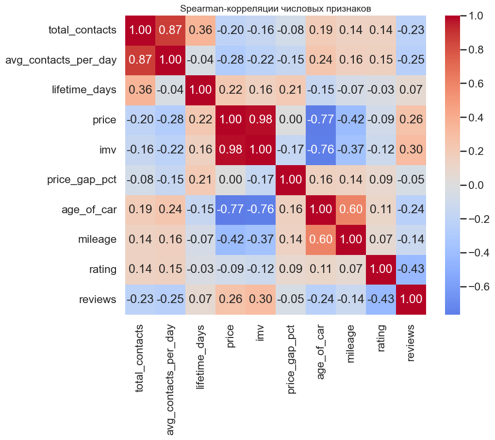
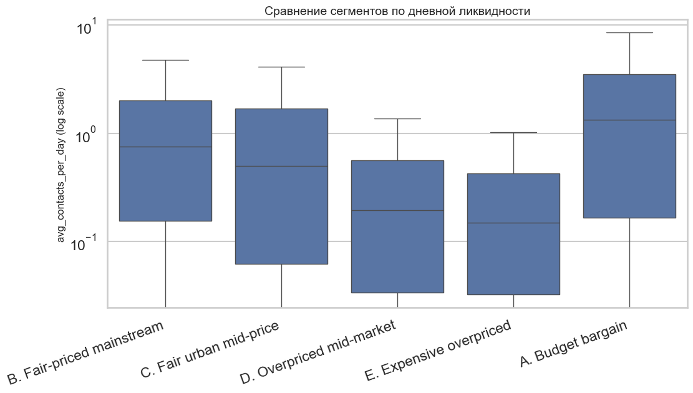
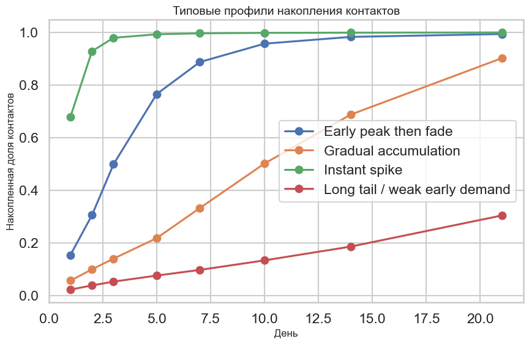
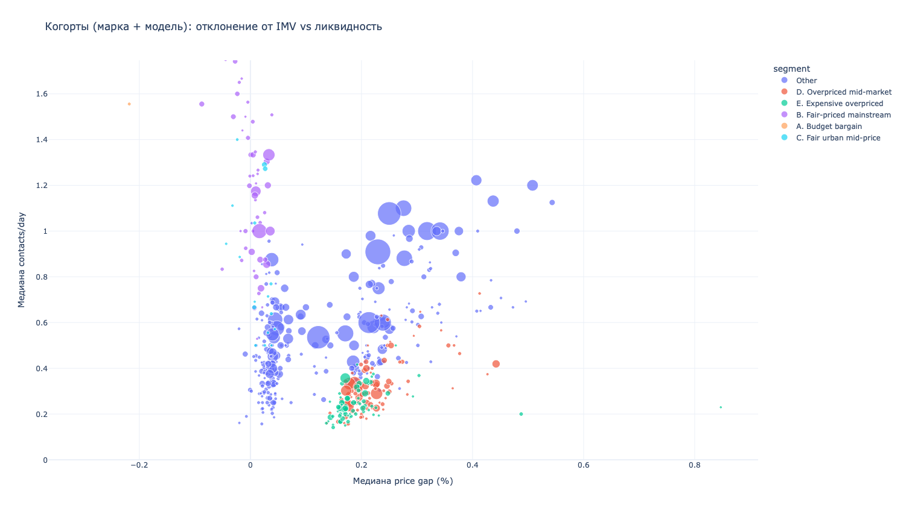

# Исследование факторов ликвидности автомобильных объявлений и оптимизация стратегии продвижения (VAS)
**Команда поколенИИИе**

---

## 1. Краткие выводы

1. **Главный драйвер ликвидности это Price-Market Fit:**
   Отклонение стоимости от рыночной оценки (IMV) выступает доминирующим фактором, который определяет интенсивность и объем контактов
2. **Фронт-лоадинг (Front-loading) спроса:**
   Более половины всех возможных контактов покупателей приходятся на первые 7 дней жизни объявления. Рынок реагирует мгновенно, если предложение выставлено по адекватной цене
3. **Практичная сегментация:**
   Мы разделили рынок на 5 ценовых сегментов от самых бюджетных до дорогих переоцененных авто. Также мы выделили специфический сегмент битых машин, который требует отдельного подхода
4. **Премиум продается быстрее:**
   Если контролировать фактор цены и качества (через NB GLM), то премиальные бренды собирают больше ежедневных контактов по сравнению с массовым сегментом
5. **Четыре базовых профиля спроса:**
   Мы выделили профили быстрого пика (Instant spike), активности первой недели (Early peak), плавного накопления (Gradual) и полного отсутствия интереса (Long tail)
6. **Риск потери денег на продвижении:**
   Для автомобилей с профилем Instant spike подключение платных услуг на старте приводит к каннибализации органики, так как эти контакты случились бы сами
7. **Триггерная стратегия продвижения:**
   VAS оптимально подключать в момент угасания органического спроса. В среднем это происходит на 5-8 день для ликвидных сегментов, когда дневной приток контактов падает в два раза
8. **Сначала цена, потом продвижение:**
   Продвигать переоцененные (Overpriced) автомобили неэффективно. Стратегия должна быть другой: сначала мы отправляем продавцу Price-nudge (совет снизить цену), а уже потом предлагаем услуги продвижения
9. **Сводный индекс ликвидности (Composite Score):**
   Мы разработали метрику от 0 до 100, которая объединяет объем, интенсивность и скорость набора контактов для ML-ранжирования выдачи объявлений
10. **План A/B тестирования:**
    Мы подготовили строгий дизайн эксперимента с рандомизацией по дням публикации, чтобы проверить реальный Uplift от предложенной стратегии продвижения

---

## 2. Постановка задачи и бизнес-контекст

Бизнес-задача заключается в понимании метрики Time-to-Sell автомобильных объявлений на платформе Авито и формировании data-driven рекомендаций для продавцов по оптимальному моменту подключения платных услуг (VAS)

Ликвидность для маркетплейса это двусторонний процесс. Быстрая продажа повышает удержание (Retention) продавца и обеспечивает платформу свежим инвентарем для покупателей, повышая конверсию. Основная проблема текущих стратегий продвижения заключается в неоптимальном расходовании бюджетов. Пользователи платят либо слишком рано, когда органика и так сильная, либо слишком поздно, когда объявление уже ушло в мертвую зону. Задача исследования состоит в поиске лучшего временного окна для каждого сегмента

---

## 3. Данные и подготовка

В исследовании использованы два набора данных:
- Датасет со статичными признаками марки, цены, оценки стоимости (IMV), региона и состояния
- Датасет с динамикой (Time-series) ежедневных контактов на протяжении жизни объявления

Процесс подготовки данных (Data Cleaning):
- **Пропуски:**
  Оценка рыночной стоимости отсутствует в 16.7% случаев. Cross-tab анализ показал, что этот пропуск не случаен, так как он соответствует статусу битого авто. Мы выделили их в отдельный сегмент
- **Выбросы:**
  Экстремальные значения вроде года выпуска до 1928 мы аккуратно ограничили через percentile clipping, чтобы не искажать распределение
- **Агрегация:**
  Ежедневная динамика была сведена к кумулятивным профилям накопления по конкретным дням

---

## 4. Определение метрик ликвидности

Ликвидность в исследовании представлена через 4 показателя:
1. **Total Contacts:**
   Суммарный объем интереса за весь срок жизни объявления
2. **Contacts per Day:**
   Интенсивность спроса. Это базовая метрика для сравнения объявлений с разным сроком жизни (Lifetime)
3. **Day to 50% Contacts:**
   Скорость первичного насыщения. Показатель того, за сколько дней собирается половина всего органического спроса
4. **Composite Liquidity Score:**
   Наша кастомная метрика, которая усредняет ранги по скорости, интенсивности и объему ранних контактов

---

## 5. Общий исследовательский анализ

Для выборки характерно явление овердисперсии (Overdispersion), когда медианное значение сильно оторвано от среднего. Это диктует необходимость лог-шкалирования и использования устойчивых статистик вроде медианы

Корреляционный анализ (Spearman) выявил первичную структуру связей. Наиболее сильная обратная зависимость с контактами наблюдается у абсолютной цены и ценового зазора (Price Gap)

  
*Рис 1. Корреляционная матрица. Видна сильная обратная зависимость дневной интенсивности контактов от отклонения цены и абсолютной стоимости*

---

## 6. Ключевые факторы ликвидности

Мы использовали градиентный бустинг и выделили 5 ключевых предикторов, которые устойчиво влияют на интенсивность контактов:

1. **Price Gap (Отклонение от рыночной цены):**
   Сильнейший фактор. Статистические модели показывают, что переоцененные сегменты теряют почти половину контактов. Анализ подтверждает, что завышенная цена строго снижает предсказание ликвидности

  
*Рис 2. Анализ признаков. Высокие значения отклонения цены в виде красных точек предсказуемо снижают вероятность быстрой продажи*

2. **Абсолютная цена:**
   Более дорогие машины имеют более узкую аудиторию, что ожидаемо увеличивает Time-to-Sell
3. **Регион:**
   Столичный рынок обеспечивает значительно большую емкость контактов при прочих равных условиях
4. **Год выпуска (Age):**
   Свежие машины с сильным дисконтом собирают трафик аномально быстро
5. **Премиум-флаг:**
   При равной цене и состоянии принадлежность к премиум-марке дает позитивный бонус к конверсии как маркер качества

---

## 7. Сегментация объявлений

На основе цены, Price Gap, региона и состояния мы выделили 5 целевых операционных сегментов и один фоновый:

- **A. Budget bargain (Высокая ликвидность):**
  Не битые авто до 300 тысяч рублей с ценой минимум на 10% ниже рынка
- **B. Fair-priced mainstream (Высокая ликвидность):**
  Не битые авто от 300 до 700 тысяч рублей с рыночной ценой
- **C. Fair urban mid-price (Средняя ликвидность):**
  Не битые авто от 700 тысяч до 1.5 миллионов рублей в рынке, только столичные регионы
- **D. Overpriced mid-market (Низкая ликвидность):**
  Не битые авто от 700 тысяч до 1.5 миллионов рублей с завышенной ценой
- **E. Expensive overpriced (Низкая ликвидность):**
  Не битые авто от 1.5 миллионов рублей с завышенной ценой

> **Слепое пятно для битых машин:**
> Автомобили без оценки IMV и битые авто мы выделили в отдельный сегмент. Их исключение из ML-сегментации технически оправдано из-за отсутствия бейзлайна цены. Однако для бизнеса это гигантский и крайне ликвидный сегмент, где сделки закрываются перекупщиками в первые часы. Динамика там экстремальная и требует отдельной логики продвижения

---

## 8. Сравнение сегментов

Различия между сегментами полностью подтверждаются статистическими тестами (Kruskal-Wallis)

| Сегмент | N (размер) | Contacts/day (мед.) | Lifetime (мед.) | Цена (мед.) | Возраст (мед.) | Топ марки и модели |
|---|---|---|---|---|---|---|
| A. Budget bargain | 20 148 | 1.33 | 6 дн. | 130 000 ₽ | 19 лет | ВАЗ (2114, 2107), Chevrolet |
| B. Fair-priced mainstream | 36 669 | 0.75 | 10 дн. | 480 000 ₽ | 14 лет | ВАЗ (Granta, Priora), Ford Focus |
| C. Fair urban mid-price | 11 081 | 0.50 | 9 дн. | 1 070 000 ₽ | 11 лет | Kia Rio, Hyundai Solaris, VW Polo |
| D. Overpriced mid-market | 56 580 | 0.20 | 23 дн. | 995 000 ₽ | 12 лет | ВАЗ, Hyundai Solaris, Kia Rio |
| E. Expensive overpriced | 35 653 | 0.15 | 29 дн. | 2 190 000 ₽ | 7 лет | Toyota Camry, Kia Sportage, BMW E-класс |

  
*Рис 3. Интенсивность контактов по выделенным сегментам. График показывает критически низкий поток спроса для переоцененных машин*

---

## 9. Динамика контактов во времени

Survival Analysis показал, что рынок реагирует очень быстро. К 7 дню накапливается более половины всех органических контактов для ликвидных сегментов

  
*Рис 4. График выживаемости показывает время до набора половины контактов. Бюджетные и рыночные сегменты стремительно вычерпывают спрос, так как их кривые резко идут вниз*

- Коэффициент (Hazard Ratio) для переоцененных объявлений значительно меньше единицы, что подтверждает реальное замедление потока контактов именно из-за цены, а не из-за плохой видимости
- Статистические тесты подтверждают значимую разницу в кривых накопления между дешевыми и переоцененными машинами

---

## 10. Типовые профили кривых

Используя методы кластеризации, мы выделили 4 поведенческих паттерна:
1. **Instant spike (Быстрый пик):**
   Более 90% контактов генерируются в первые два или три дня. Это характерно для самых дешевых и битых авто, которые моментально вымываются рынком
2. **Early peak (Ранний интерес):**
   Более 85% контактов за первые 7 дней. Это классическая кривая здорового массового рынка
3. **Gradual (Плавное накопление):**
   Интерес размазан на несколько недель. Часто встречается у премиальных автомобилей с узким спросом
4. **Long tail (Слабый спрос):**
   Почти нет раннего спроса, объявление собирает единичные контакты. Это абсолютная норма для переоцененных предложений

  
*Рис 5. Центроиды поведенческих паттернов. Зеленая линия наглядно показывает, что профиль быстрого пика (Instant spike) генерирует почти 100% спроса в первые 3 дня*

Примечание про вторые пики интереса. Наш анализ показал, что органических вторых пиков практически не бывает. Повторный всплеск может быть спровоцирован только снижением цены (Price-drop) или включением платного продвижения

---

## 11. Рекомендации по VAS

Стратегия продвижения должна базироваться на органической кривой и разрыве в цене (Price Gap). Мы определили Trigger Day как день, когда объявление собрало половину ожидаемого объема контактов, а дневной приток упал вдвое от стартового уровня

  
*Рис 6. Оптимальный день для запуска продвижения по сегментам. Для массовых рыночных предложений точка идеального запуска находится на 5 или 8 день*

Стратегии по сегментам:
- **Сегменты A и B (Бюджетные и рыночные):**
  Оптимальное время для платных услуг наступает на 5-8 день. Именно в этот момент органика выдыхается и VAS выступает как необходимый стимул для закрытия сделки
- **Опасность каннибализации:**
  Если объявление имеет профиль Instant spike в первые дни, VAS на старте только вредит бюджету продавца. Клиент платит за трафик, который пришел бы органически в любом случае. Платные услуги здесь нужны только как страховочный механизм после 5 дня
- **Сегменты D и E (Overpriced):**
  Подключать продвижение для машин с завышенной ценой неэффективно, так как конверсия из клика в контакт будет минимальной. Сначала платформа должна отправить продавцу Price-nudge (совет снизить цену). Через сутки после снижения авто переходит в сегмент рыночных цен и ловит второй органический пик. Включение VAS именно в этот момент даст максимальный результат

*Рис 7. Сравнение агрегированных когорт. Ярко выражен тренд концентрации наиболее ликвидных групп в районе нулевого отклонения (в рынке), в то время как переоцененные машины падают на дно по интенсивности контактов* 

Примеры конкретных автомобилей (с Bootstrapped Trigger Days):
- **Toyota Camry в регионах (Fair-priced):**
  Органика выгорает к 8 дню. Мы рекомендуем подключать услуги продвижения именно с 8 дня
- **Kia Rio в столице (Fair urban):**
  Высокая плотность рынка приводит к более быстрому выгоранию к 6 дню. Оптимально подключать продвижение с 6 дня
- **Hyundai Solaris в столице (Overpriced):**
  Органический интерес мертв с первого дня. Мы настоятельно рекомендуем сначала скорректировать цену до рыночной (IMV), а только потом оплачивать продвижение

---

## 12. Статистическая валидация и надежность выводов

- **Internal Validity:** Мы использовали робастные тесты и Bootstrapping для оценки доверительных интервалов, так как распределения контактов не нормальны
- **Sensitivity Analysis:** Мы проверили стабильность результатов при удалении аномальных объявлений по контактам. Выводы не изменились, что говорит о высокой устойчивости наших расчетов
- **Explainability:** Ограничения линейных моделей были успешно сняты с помощью градиентного бустинга и TreeSHAP анализа

---

## 13. Практическая ценность и внедрение

Предложенные выводы могут быть напрямую внедрены в продукт Авито через две инициативы:

**1. A/B Тест сегментного VAS-триггера:**
- Рандомизация пользователей по дням публикации поможет избежать пересечения тестовых и контрольных объявлений в выдаче
- Контрольная группа (Control) получит базовую подсказку
- Тестовая группа (Treatment) получит персональные уведомления на 5-8 день или совет снизить цену для переоцененных авто
- Главной метрикой (OEC) станет конверсия в продажу на платформе и средний Time-to-Sell

**2. Индекс ликвидности:**
Интеграция нашего скора ликвидности как базового показателя (Бейзлайна) для ML-ранжирования в ленте рекомендаций

---

## 14. Ограничения исследования

1. В данных нет факта использования платных услуг. Мы строили рекомендации на базе падения органической кривой, поэтому реальный Uplift можно подтвердить только в предложенном эксперименте
2. В датасете нет данных по показам и просмотрам. Мы не можем с уверенностью отделить ситуацию отсутствия показов от ситуации, когда машину показали, но на нее не кликнули из-за высокой цены

---

## 15. Финальные выводы

Наши данные подтверждают простую философию. Лучшая стратегия продвижения заключается в адекватной цене на старте. Основной рыночный сигнал генерируется в первые 7 дней. Платно пушить объявления с завышенной ценой неэффективно. При этом продвигать ультра-выгодные сделки в первые дни означает сжигать деньги клиента впустую из-за каннибализации органики. Умное платное продвижение (VAS) должно выступать как дефибриллятор. Его нужно применять строго в момент падения органического интереса, чтобы вернуть объявление к жизни. Внедрение такого data-driven подхода способно значительно поднять конверсию в продажу на платформе и лояльность продавцов
